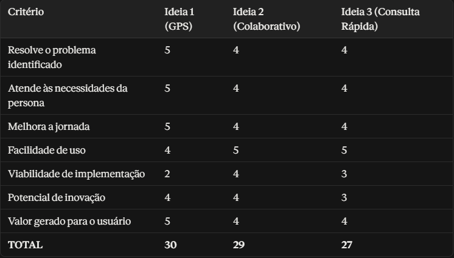

# Etapa 4 — 💡 Ideação
## Guia Prático para a Aula

### Alunos:
- Filipe Thiago Ribeiro Silva RA:22602209
- Luiz Fernando Cardos Timo RA:22610307 - Github:luizcft22
- Fellipe Cauã do Carmo RA:22550880 - Github:fellipecr-droid
### Qual problema queremos resolver?

Os horários exibidos no app de transporte público não correspondem ao horário real de chegada e saída dos ônibus. Além disso, há uma grande quantidade de anúncios que atrapalham o uso do aplicativo durante momentos importantes.

### Quem é o usuário?

Estudantes e trabalhadores que dependem do transporte público em seu dia a dia.

### Qual é a principal necessidade desse usuário?

Confiar na informação de horário para não perder tempo esperando ou acabar perdendo o ônibus.

### Qual é a principal dor identificada na jornada?

O usuário chega ao ponto confiando no horário do app e descobre que o transporte já passou, ou enfrenta dificuldades para verificar o status rapidamente, perdendo tempo e, às vezes, o próprio transporte.

### Em qual momento essa dor acontece?

Durante a pesquisa de disponibilidade do transporte para compromissos que possuem horários fixos.

### O que deveria melhorar na experiência?
- A confiabilidade e a atualização em tempo real das informações de horário.
- A experiência geral de uso do aplicativo.
- A remoção da interferência causada por anúncios.

### **Como poderíamos...?**

Como poderíamos ajudar estudantes e trabalhadores a confiar no horário real de chegada do transporte e consultar essas informações rapidamente, sem a interferência de anúncios no app?

### 💡 Ideia 1

**Rastreio em tempo real**  
**Descrição:**  
 Mapa ao vivo com GPS, disponível gratuitamente.

**Como funciona?**  
 Mapa no aplicativo que mostra onde o transporte se encontra naquele momento.

**Qual dor da jornada resolve?**  
 Resolve o problema do rastreio do atraso do transporte.

**Benefício para o usuário:**  
 Mais confiabilidade no horário do app.

**Principais funcionalidades:**  
 Mapa ao vivo com GPS.

**Possíveis limitações:**
 Má conexão com a internet.

### 💡 Ideia 2

**Reporte colaborativo**  
**Descrição:**  
Botão de reporte para o horário real coletivo.

**Como funciona?**  
Usuários do app relatam e confirmam se o transporte está ou no horário ou não.

**Qual dor da jornada resolve?**  
A identificação de possíveis atrasos não reportados pelo app automaticamente.

**Benefício para o usuário:**  
Mais facilidade para verificar os horários.

**Principais funcionalidades:**  
Botão de fácil acesso no app para reporte.

**Possíveis limitações:**  
Reportes errados por parte dos usuários.

### 💡 Ideia 3

**Modo de consulta rápida**  
**Descrição:**  
Modo de visualização simplificado que prioriza o horário da linha buscada.

**Como funciona?**  
Modo de acesso rápido para pesquisa de linhas fixadas.

**Qual dor da jornada resolve?**  
Tempo perdido navegando por anúncios para encontrar a informação.

**Benefício para o usuário:**  
Acesso mais rápido ao dado mais importante.

**Principais funcionalidades:**  
Modo "Consulta rápida", linhas favoritas, delay de anúncios pós consultas

**Possíveis limitações:**  
Depende da mudança no modelo de monetização do app.

### Tabela de Comparação das Ideias

## Solução Escolhida
- Permitir que os usuários reportem o horário do transporte e exibir o horário reportado de forma limpa, antes de anúncios.
  
### Justificativa
- Combinar as duas ideias facilita o uso do transporte público e melhora a experiência do usuário durante o uso do app.

